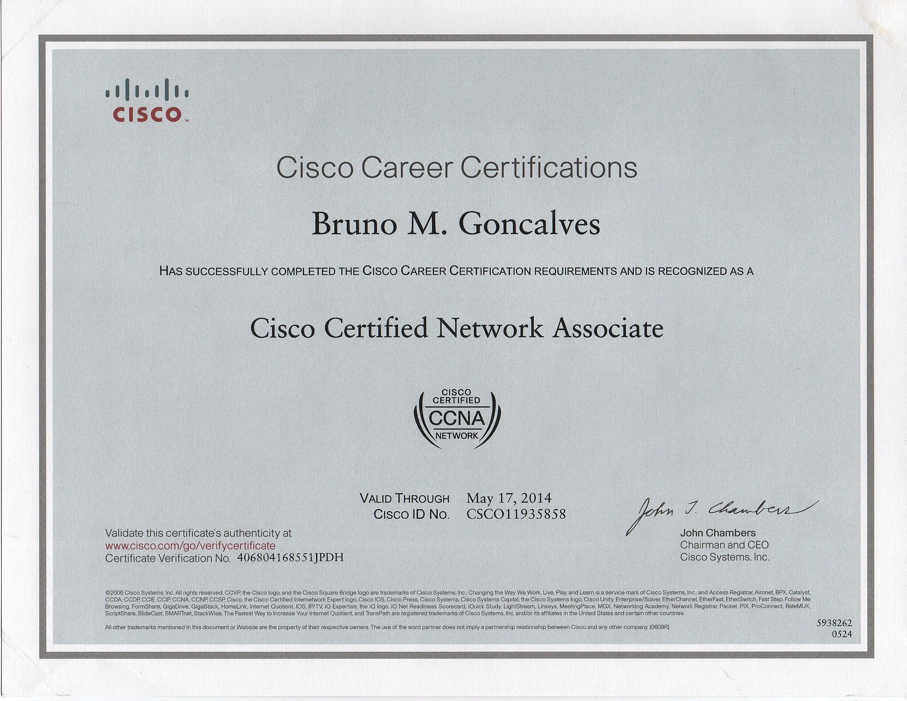

# Bruno Gonçalves - Resume

---

## Summary
Aspiring IT professional and programmer with certifications in AWS, Linux Essentials, and Lean Six Sigma. Passionate about learning, problem-solving, and building impactful projects.

---

## Education
**Bachelor's in IT Engineering**  
University Aberta, 2024 - Present

---

## Certifications

| Certification                           | Status       | Link                                                                 |
|:---------------------------------------|:------------|:--------------------------------------------------------------------|
| **AWS Certified Cloud Practitioner**    | Active       | [Verify](https://cp.certmetrics.com/amazon/en/public/verify/credential/4daba3c5b8f94a68954ba1834e502af0) |
| **Linux Essentials**                    | Active       | [Verify](https://lpi.org/v/LPI000611806/r7maujk2d2)                  |
| **Lean Six Sigma Black Belt**           | Active       | [Verify](https://the.glss.app/public/certificates/75138)             |
| **Cisco Certified Network Associate (CCNA)** | Expired |                          |

---

## Experience
**Team Lead - Portuguese Customer Service**  
Swappie, Helsinki, Finland  
2011 - Present  

- Lead and manage a team to deliver excellent customer support.  
- Collaborate with cross-functional teams to improve operations.  

---

## Skills
- **Programming Languages**: C (beginner), Python (beginner)  
- **Tools**: GitHub, Linux Systems, Debugging  
- **Certifications**: AWS, Networking, Process Improvement  

---

[Download My Resume as PDF](resume.pdf)
